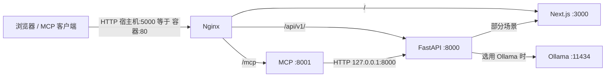

# 容器部署架构说明

本文描述使用官方 `Dockerfile` / `docker-compose.yml` 部署时，**单个容器内**各进程的职责、端口及请求关系。配置以仓库根目录的 `nginx.conf`、`start.js` 为准。

## 单容器、多进程

- **部署单元**：一个 Docker 镜像 / 一个运行中的容器（例如 compose 中的 `production` 服务）。
- **进程模型**：容器入口为 `node /app/start.js`，由该脚本拉起多个子进程；对外 HTTP 仅通过 **Nginx 监听 80**（compose 中常映射为宿主机 `5000:80`）。

## 组件一览

| 组件 | 典型监听 | 是否经 Nginx 对外 | 作用 |
|------|-----------|-------------------|------|
| **Nginx** | `80` | 是（容器对外主入口） | 反向代理、长超时、部分路径直接读盘 |
| **Next.js** | `127.0.0.1:3000` | 否（仅本机，经 `/` 反代） | Web 前端与相关交互 |
| **FastAPI** | `8000` | 否（经 `/api/v1/`、`/docs` 等） | 主业务 REST API |
| **MCP** | `127.0.0.1:8001` | 否（经 `/mcp`、`/mcp/`） | 基于 OpenAPI 的 MCP 入口，内部调用 FastAPI |
| **Ollama** | 默认 `11434` | 否（未在 Nginx 中暴露） | 可选本地推理；由应用按配置访问 |

## Nginx 路由（与 `nginx.conf` 对应）

- **`/`** → `http://localhost:3000`（Next.js），并设置 WebSocket 相关头，供前端长连接等场景使用。
- **`/api/v1/`** → `http://localhost:8000`（FastAPI）。
- **`/mcp`、`/mcp/`** → `http://localhost:8001` 上 MCP 服务的对应路径。
- **`/docs`、`/openapi.json`** → FastAPI 的文档与 OpenAPI 规范。
- **`/static`**、**`/app_data/...` 各子路径** → 文件系统别名，不经过 Next/FastAPI 端口。

因此：**浏览器或外部 HTTP 客户端只需访问宿主机映射端口（如 5000），等价于访问容器内 80；路径决定流量进入 Next、FastAPI 或 MCP。**

## 组件间关系

1. **Nginx**：统一入口，按路径分流；Next 与 FastAPI、MCP 均不直接对公网暴露各自端口（Next/MCP 绑定本机回环）。
2. **Next.js 与 FastAPI**：页面由 Next 提供；业务数据主要通过同源路径 **`/api/v1/...`** 经 Nginx 转到 FastAPI。FastAPI 侧在部分场景也会请求本机 Next（例如布局相关接口），属于**服务端到服务端**调用。
3. **MCP 与 FastAPI**：`mcp_server.py` 使用 HTTP 客户端 **`http://127.0.0.1:8000`** 调用现有 REST API；MCP 是在 FastAPI 之上的**协议适配层**，并非第二套业务实现。
4. **Ollama**：默认由 `start.js` 启动 `ollama serve`（与上述服务并列）；**不在 Nginx 路由中**。使用 `docker-compose build production` 时，`docker-compose.yml` 传入 **`INSTALL_OLLAMA=false`**，镜像内不安装 Ollama，且 **`ENABLE_OLLAMA=false`** 会跳过启动内置进程；此时若仍用 Ollama 作 LLM，请在配置里把 **`OLLAMA_URL` 指向宿主机或其它可访问的 Ollama 服务**（注意容器内 `localhost` 与宿主机的区别）。直接 `docker build` 未传该 build-arg 时仍为安装并启动内置 Ollama。

## 请求流向示意

## 水平扩展与注意事项

- 官方镜像设计为**单容器内多进程**；若运行多个容器副本，需自行处理**会话、数据库、`app_data` 卷、Ollama 资源**等是否可多实例共享。
- 修改端口或拆分为多容器部署时，需同步调整 **`nginx.conf`**、`start.js` 与环境变量，并保持路径反代一致。

## 相关文件

- `Dockerfile` — 镜像构建与默认 `CMD`
- `docker-compose.yml` — 端口映射（如 `5000:80`）、卷与环境变量
- [docker-compose-environments.md](./docker-compose-environments.md) — **`production` 与 `development` 构建/运行差异**、**Docker 权限与 compose 变量警告**
- [pytorch-docling.md](./pytorch-docling.md) — **为何安装 PyTorch（Docling 文档解析）**
- `nginx.conf` — 对外路由与反代目标
- `start.js` — 进程编排（FastAPI、MCP、Next、Ollama、Nginx 启动）
- `servers/fastapi/mcp_server.py` — MCP 服务及对 FastAPI 的 `base_url`
