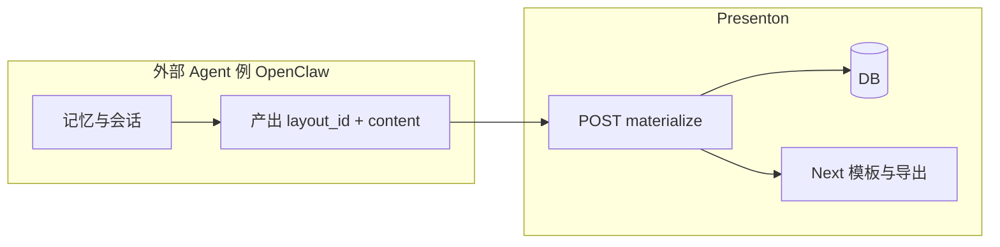

# 外部智能体物化演示文稿（无 Presenton 侧 LLM）

本文档描述将 **OpenClaw（或任意外部 Agent）** 作为唯一「大脑」时，Presenton 侧应提供的 **物化（materialize）** 能力的设计：会话与记忆留在 Agent，Presenton 负责校验、落库、渲染与导出。

**状态**：已实现。HTTP 路由 `POST /api/v1/ppt/presentation/materialize`（FastAPI 前缀 `/api/v1/ppt` + `presentation` router）。本仓库 **已删除** 服务端 LLM 驱动的 `generate` / `create` / `prepare` / `stream` / `edit` / `derive` 等接口；Next.js 内置向导若仍调用旧路径将失败，请以外部 Agent + 物化 API 或自行恢复路由为准。

---

## 1. 背景与目标

### 1.1 问题

- 上游 Presenton 的 `POST .../presentation/generate` 等路径曾在服务端调用 `generate_ppt_outline`、`generate_presentation_structure`、`get_slide_content_from_type_and_outline` 等，**依赖 Presenton 已配置的 LLM**（本仓库对应路由已移除）。
- 内置 MCP（`servers/fastapi/mcp_server.py`）通过 OpenAPI 将上述 HTTP 能力暴露为工具，**并不替代**服务端推理。

### 1.2 目标

| 目标 | 说明 |
|------|------|
| 单一大脑 | 长上下文、用户偏好、多轮澄清、检索增强等 **仅在外部 Agent（如 OpenClaw）** 内维护。 |
| Presenton 无模型 | Presenton FastAPI 在物化路径上 **不调用** OpenAI / Anthropic / Google / Ollama / Custom / Codex 等 LLM 客户端。 |
| 交付不变 | 仍写入与现网一致的 `presentations` / `slides` 表，并复用 **导出**（PPTX/PDF）链路。 |

### 1.3 非目标（首版可不做）

- 不在物化接口内做文档上传解析、联网搜索、目录页自动插入等；若需要由 Agent 生成对应页后再物化。
- 不解决「Agent 与 Presenton 分机部署」时 `mcp_server.py` 内写死 `127.0.0.1:8000` 的问题（另见部署说明）。

---

## 2. 架构分工



- **Agent**：根据模板 JSON Schema 生成每页 `layout_id` 与 `content`；可选附带 `outline_summary`、`speaker_note`。
- **Presenton**：拉取模板定义、校验、写 `PresentationModel` / `SlideModel`、调用现有导出逻辑。

---

## 3. 依赖与前提

1. **模板定义来源**：与现网一致，`get_layout_by_name` 通过 **Next** 的 `GET http://localhost/api/template?group={template}` 获取 `PresentationLayoutModel`（含每页 `id` 与 `json_schema`）。物化前须保证该服务可用。
2. **导出**：`export_presentation` 仍通过 Next 的 `presentation_to_pptx_model` / `export-as-pdf` 完成（见 `utils/export_utils.py`）。
3. **Agent 发现版式**：建议通过只读 API 或 MCP 工具先拉取某 `template` 下全部 `slides[].id` 与 `json_schema`，再生成请求体。

---

## 4. 接口契约

### 4.1 路由与方法（建议）

| 项 | 值 |
|----|-----|
| 方法 | `POST` |
| 路径 | `/api/v1/ppt/presentation/materialize` |
| Content-Type | `application/json` |

**语义**：在 **不调用任何 LLM** 的前提下，将结构化幻灯片写入数据库并导出。

### 4.2 请求体字段

#### 4.2.1 顶层

| 字段 | 类型 | 必填 | 说明 |
|------|------|------|------|
| `schema_version` | string | 否 | 契约版本，建议 `"1.0"`。 |
| `template` | string | 是 | 与现有一致：`general` / `modern` / `standard` / `swift`（见 `constants/presentation.py`）或 `custom-{uuid}`。 |
| `slides` | array | 是 | 有序；长度 ≥ 1；顺序即页码 `0..n-1`。 |
| `export_as` | `"pptx"` \| `"pdf"` | 是 | 导出格式。 |
| `language` | string | 否 | 默认 `"English"`；写入 `PresentationModel.language`。 |
| `title` | string | 否 | 写入 `PresentationModel.title`；缺省策略由实现定义（如首条 `outline_summary` 或占位）。 |
| `presentation_id` | uuid | 否 | 缺省由服务端生成。若传入且已存在：建议返回 **409**，首版可不支持覆盖更新。 |
| `content` | string | 否 | 整稿说明 / 会话摘要，仅审计与展示，**不参与**服务端生成逻辑。 |
| `instructions` | string | 否 | 写入 `PresentationModel.instructions`。 |
| `tone` | string | 否 | 与现有枚举一致，默认同 `GeneratePresentationRequest`。 |
| `verbosity` | string | 否 | 同上。 |
| `theme` | object | 否 | 写入 `PresentationModel.theme`。 |

#### 4.2.2 `slides[]` 每项

| 字段 | 类型 | 必填 | 说明 |
|------|------|------|------|
| `layout_id` | string | 是 | 必须为该 `template` 下某一 `SlideLayoutModel.id`。 |
| `content` | object | 是 | 必须符合该 `layout_id` 对应 `json_schema`；服务端校验，失败 **422**。 |
| `outline_summary` | string | 否 | 一页一句摘要；用于组装 `PresentationModel.outlines`（见 4.3）。 |
| `speaker_note` | string | 否 | 写入 `SlideModel.speaker_note`。 |
| `html_content` | string | 否 | 写入 `SlideModel.html_content`；若导出链路不读可省略。 |
| `properties` | object | 否 | 写入 `SlideModel.properties`。 |

### 4.3 服务端派生字段（客户端不传）

| 目标字段 | 规则 |
|----------|------|
| `PresentationModel.layout` | 由 `get_layout_by_name(template)` 得到的 `PresentationLayoutModel.model_dump()`。 |
| `PresentationModel.structure` | `PresentationStructureModel`：`slides[i] = layout.get_slide_layout_index(slides[i].layout_id)`。 |
| `PresentationModel.outlines` | `PresentationOutlineModel`：`slides[k].content = slides[k].outline_summary`；若缺省则实现可选用 `content` 内固定键截断或顶层 `content` 占位（实现需文档化一种策略）。 |
| `PresentationModel.n_slides` | `len(slides)`。 |
| `SlideModel.layout_group` | 与模板 `PresentationLayoutModel.name` 一致。 |
| `SlideModel.layout` | 该页在模板中的布局标识：与现有生成链路一致，为对应 `SlideLayoutModel.id`（与请求 `layout_id` 相同）。 |
| `SlideModel.index` | 数组下标。 |
| `SlideModel.id` | 每页新生成 uuid。 |

**资源与配图**：首版可不调度 `ImageGenerationService`；若 `content` 内仅含外链或静态资源，由现有导出/前端渲染路径消费（行为以实现为准，建议在文档版本号中注明）。

### 4.4 响应体

与现有生成成功一致，使用 **`PresentationPathAndEditPath`**（或同结构 JSON）：

- `presentation_id`
- `path`（导出文件路径）
- `edit_path`（如 `/presentation?id={uuid}`）

### 4.5 错误码（建议）

| HTTP | 场景 |
|------|------|
| 400 | `slides` 为空、未知 `template`、`layout_id` 不属于该模板、模板拉取失败（可区分 502）。 |
| 422 | `content` 不符合 `json_schema`（建议 body 含 `detail` / `errors[]`）。 |
| 409 | 显式传入的 `presentation_id` 已存在（若采用「禁止覆盖」策略）。 |
| 502 / 500 | Next 不可用或导出失败。 |

### 4.6 请求示例（结构示意）

`layout_id` 与 `content` 键名须与真实模板一致；以下为形状示例：

```json
{
  "schema_version": "1.0",
  "template": "general",
  "title": "产品周会",
  "language": "Chinese",
  "export_as": "pptx",
  "content": "由 Agent 压缩的会话主题（可选）",
  "slides": [
    {
      "layout_id": "title_slide_layout_id_from_template",
      "outline_summary": "封面：产品周会",
      "content": {
        "title": "产品周会",
        "subtitle": "2026 Q2"
      },
      "speaker_note": "开场 30 秒"
    },
    {
      "layout_id": "bullets_layout_id",
      "outline_summary": "本周进展",
      "content": {
        "bullets": ["事项 A", "事项 B"]
      }
    }
  ]
}
```

---

## 5. 与 MCP 的关系

- 在 `openai_spec.json` 中增加上述路径的 OpenAPI 描述（`operationId` 建议 `materialize_presentation`），即可被 **FastMCP.from_openapi** 自动暴露为工具。
- 或单独注册 MCP 工具，内部 HTTP 调用同一物化接口。
- **注意**：当前 `mcp_server.py` 中 `httpx.AsyncClient(base_url="http://127.0.0.1:8000")` 仅适合 MCP 与 API 同机；跨主机需可配置的 `PRESENTON_API_BASE_URL` 等（另案）。

---

## 6. 实现说明（与代码对应）

1. **路由**：`presentation` 路由上 `POST /materialize`（完整路径见上节）。
2. **模块**：
   - 请求体模型：`models/materialize_presentation_request.py`
   - 大纲/标题/JSON Schema 校验：`utils/materialize_helpers.py`
   - 模板名校验（内置或 `custom-{uuid}`）：`utils/template_validation.py`（`/generate` 的模板检查已复用同一函数）
3. **行为**：拉取布局 → 校验每页 `layout_id` 与 `content` 相对 `json_schema` → 写库 → `export_presentation` → 发送 `PRESENTATION_GENERATION_COMPLETED` webhook（与同步生成成功一致）。
4. **测试**：`tests/test_materialize_presentation.py`（不加载完整 FastAPI app，避免 Chroma 等副作用）。
5. **MCP**：`openai_spec.json` 已增加 `materialize_presentation` 操作。

---

## 7. 版本与演进

| 版本 | 说明 |
|------|------|
| `schema_version: 1.0` | 本文档描述的字段集与语义。 |
| 未来 | 可增加幂等覆盖、局部更新幻灯片、与配图服务可选集成等；通过 `schema_version` 或新路径区分。 |

---

## 8. 相关代码索引（现状）

| 说明 | 路径 |
|------|------|
| 主应用路由注册 | `servers/fastapi/api/main.py` |
| 演示生成（含 LLM） | `servers/fastapi/api/v1/ppt/endpoints/presentation.py` |
| 布局拉取 | `servers/fastapi/utils/get_layout_by_name.py` |
| 导出 | `servers/fastapi/utils/export_utils.py` |
| 表模型 | `servers/fastapi/models/sql/presentation.py`、`servers/fastapi/models/sql/slide.py` |
| 结构 / 大纲模型 | `servers/fastapi/models/presentation_structure_model.py`、`servers/fastapi/models/presentation_outline_model.py` |
| MCP 入口 | `servers/fastapi/mcp_server.py`、`servers/fastapi/openai_spec.json` |

---

## 9. 修订记录

| 日期 | 说明 |
|------|------|
| 2026-04-10 | 初版：外部 Agent 物化接口契约与架构说明。 |
| 2026-04-10 | 实现 `POST .../materialize`、辅助模块、单测与 OpenAPI 片段。 |
